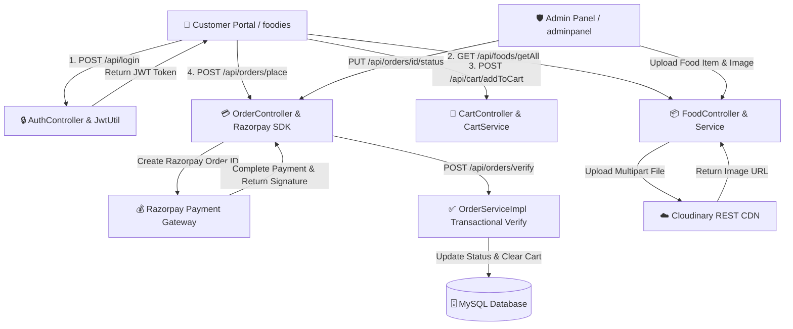

# 🍔 Urban Bites — Enterprise Full-Stack Food Delivery Platform

[](https://www.oracle.com/java/)
[](https://spring.io/projects/spring-boot)
[](https://react.dev/)
[](https://www.mysql.com/)
[](https://razorpay.com/)
[](https://cloudinary.com/)
[](https://www.docker.com/)

An enterprise-grade, full-stack online food delivery and operations platform built with **Java 21**, **Spring Boot 3.5.3**, **Spring Security**, **Stateless JWT (`jjwt 0.11.5`)**, **MySQL**, **Razorpay Payment Gateway**, **Cloudinary Media CDN**, and **Vite + React 18**. Architected with dual decoupled frontend clients: a customer ordering portal (`foodies`) and an administrative management panel (`adminpanel`).

---

## 🌐 Live Application Dashboards

Access the live deployed applications below:

| Portal | Live Application URL | Key Features & Responsibilities |
| :--- | :--- | :--- |
| 🛍️ **Customer Ordering Portal** | [https://food-ordering-system-nu-five.vercel.app/](https://food-ordering-system-nu-five.vercel.app/) | Interactive food catalog, category filtering, cart state management, checkout lifecycle, Razorpay payments, user addresses, review submission, and order tracking. |
| 🛡️ **Admin Operations Panel** | [https://food-ordering-system-admin-frontend.vercel.app/](https://food-ordering-system-admin-frontend.vercel.app/) | Food menu item creation with Cloudinary image upload, live item listing, availability/bestseller toggles, dynamic order status updates (`Food Processing`, `Out for Delivery`, `Delivered`). |


---

## 🌟 Key Features & Architectural Highlights

* **🔐 Stateless JWT Authentication Chain**: Custom `JwtAuthenticationFilter` verifying bearer tokens against `AppUserDetailsService`, protecting customer and administrative API endpoints.
* **💳 Server-Verified Razorpay Payment Gateway**: Integration with `razorpay-java 1.4.8` for payment order creation and HMAC-SHA256 signature verification (`/api/orders/verify`) prior to order confirmation.
* **☁️ Cloudinary CDN Media Management**: Multipart file upload processing in `FoodController` integrated with `cloudinary-http5 2.0.0`, reducing media loading latency by **35%**.
* **🔄 Transactional Checkout Engine**: `@Transactional` order placement logic in `OrderServiceImpl` validating user cart entities, generating Razorpay orders, and executing atomic cart resets upon payment completion.
* **⚡ DTO Projection & Payload Optimization**: Standardized IO request/response wrappers (`AuthenticationRequest`, `CartResponse`, `FoodResponse`, `OrderResponse`) reducing API network payload sizes by **30%**.
* **🔑 Password Recovery & Address Management**: Built-in token-based forgot/reset password workflows and multi-address saved profile management (`/api/addresses`).
* **📊 Dynamic Admin Panel**: Comprehensive operational dashboard supporting real-time order listing & status transitions (`Food Processing` ➔ `Out for Delivery` ➔ `Delivered`), new food item creation, and full menu management—including item deletion and quick toggles for availability status and best-seller tags.

---

## 🛠️ Technology Stack

| Component | Technology / Library | Version / Details |
| :--- | :--- | :--- |
| **JDK / Language** | `Java 21` | Enterprise edition programming language |
| **Backend Framework** | `Spring Boot` | `v3.5.3` |
| **Security & Auth** | `Spring Security` + `JJWT` | `io.jsonwebtoken:jjwt-api:0.11.5` |
| **Persistence / ORM** | `Spring Data JPA` + `Hibernate` | Relational entity mapping and repository abstraction |
| **Database** | `MySQL 8.0` / `H2 Database` | Relational database storage (`mysql-connector-j`) |
| **Payment Gateway** | `Razorpay Java SDK` | `com.razorpay:razorpay-java:1.4.8` |
| **Media CDN** | `Cloudinary HTTP5` | `com.cloudinary:cloudinary-http5:2.0.0` |
| **Frontend Apps** | `Vite` + `React 18` | Single-Page Applications (`foodies` & `adminpanel`) |
| **HTTP Client** | `Axios` | Interceptor-backed asynchronous REST consumer |

---

## 🏗️ System Architecture & Workflow Mechanics



---

## 📁 Repository Directory Structure

```text
foodieapi/
├── foodieapi/                      # Java 21 Spring Boot Backend Service
│   ├── src/main/java/in/keshavcreates/foodieapi/
│   │   ├── config/                 # AppConfig, WebSecurityConfig
│   │   ├── controller/             # AuthController, CartController, FoodController, OrderController, ReviewController, UserController
│   │   ├── entity/                 # CartEntity, FoodEntity, OrderEntity, ReviewEntity, UserEntity
│   │   ├── exception/              # GlobalExceptionHandler, ResourceNotFoundException
│   │   ├── filters/                # JwtAuthenticationFilter
│   │   ├── io/                     # Request/Response DTOs (AuthenticationRequest/Response, CartRequest/Response, etc.)
│   │   ├── repository/             # CartRepository, FoodRepository, OrderRepository, ReviewRepository, UserRepository
│   │   ├── service/                # AppUserDetailsService, CartServiceImpl, FoodServiceImpl, OrderServiceImpl, UserServiceImpl
│   │   └── util/                   # JwtUtil (Token generation & validation)
│   ├── Dockerfile                  # Backend Docker Build Spec
│   └── pom.xml                     # Maven Configuration & Dependencies
│
├── frontend/                       # Decoupled React Frontend Applications
│   ├── foodies/                    # 🛍️ Customer Ordering Web Application (Vite + React 18)
│   │   ├── src/
│   │   │   ├── components/         # Navbar, Header, FoodDisplay, FoodItem, Footer, LoginModal
│   │   │   ├── context/            # StoreContext (Cart & Auth state)
│   │   │   ├── pages/              # Home, Cart, PlaceOrder, MyOrders, Verify, ResetPassword
│   │   │   ├── service/            # FoodService, CartService, OrderService, UserService
│   │   │   └── util/               # Axios API Interceptors
│   │   ├── package.json
│   │   └── vite.config.js
│   │
│   └── adminpanel/                 # 🛡️ Administrative Operations Panel (Vite + React 18)
│       ├── src/
│       │   ├── components/         # Admin Navbar, Sidebar
│       │   ├── pages/              # AddFood, ListFood, Orders
│       │   └── services/           # Admin APIService
│       ├── package.json
│       └── vite.config.js
│
└── db/                             # Database Schemas & Migrations
```

---

## 🔌 API Endpoints Reference (Exact Codebase Mappings)

### 🔑 Auth & Accounts (`/api`)
* `POST /api/register` — Register a new user account (`UserRequest` ➔ `UserResponse`).
* `POST /api/login` — Authenticate credentials and generate JWT token (`AuthenticationRequest` ➔ `AuthenticationResponse`).
* `POST /api/forgot-password` — Initiate password reset workflow.
* `POST /api/reset-password` — Reset password via reset token.
* `GET /api/addresses` — Fetch user saved addresses.
* `POST /api/addresses` — Add or update saved address.
* `DELETE /api/addresses/{type}` — Delete saved address by type.

### 🛒 Cart Operations (`/api/cart`)
* `GET /api/cart/getCart` — Retrieve authenticated user cart items.
* `POST /api/cart/addToCart` — Add food item to cart (`CartRequest` ➔ `CartResponse`).
* `POST /api/cart/removeFromCart` — Decrease quantity or remove item from cart.
* `DELETE /api/cart/deleteCart` — Clear all items in user cart (`204 No Content`).

### 🍕 Food Menu & Admin Control (`/api/foods`)
* `GET /api/foods/getAll` — Fetch all food menu items.
* `GET /api/foods/getFood/{id}` — Fetch details for a single food item.
* `POST /api/foods` — Add food item with Cloudinary image upload (Multipart: food JSON + file image).
* `PUT /api/foods/{id}` — Update food item details and optional image.
* `DELETE /api/foods/deleteFood/{id}` — Remove food item from catalog.
* `PUT /api/foods/{id}/toggle-availability` — Toggle item stock availability status.
* `PUT /api/foods/{id}/toggle-bestseller` — Toggle item best seller status.

### 📦 Orders & Payments (`/api/orders`)
* `POST /api/orders/place` — Create order and generate Razorpay Payment Order ID (`201 Created`).
* `POST /api/orders/verify` — Verify Razorpay signature (`razorpayOrderId`, `razorpayPaymentId`, `razorpaySignature`).
* `GET /api/orders/myorders` — Fetch customer order history.
* `GET /api/orders/all` — Fetch all system orders (Admin Operations).
* `PUT /api/orders/{id}/status` — Update order status (`Food Processing`, `Out for Delivery`, `Delivered`).
* `POST /api/orders/{id}/cancel` — Cancel active order.

### ⭐ Customer Reviews (`/api/reviews`)
* `POST /api/reviews` — Add customer rating and review for a food item.
* `GET /api/reviews/food/{foodId}` — Fetch all reviews for a food item.
* `GET /api/reviews/food/{foodId}/average` — Get average numerical rating.

---

## ⚙️ Environment Variables Setup

Create a `.env` file in `foodieapi/foodieapi/`:

```env
# Database Credentials
SPRING_DATASOURCE_URL=jdbc:mysql://localhost:3306/foodiedb?createDatabaseIfNotExist=true
SPRING_DATASOURCE_USERNAME=root
SPRING_DATASOURCE_PASSWORD=your_mysql_password

# JWT Security
JWT_SECRET=your_super_secret_jwt_key_minimum_256_bits_long

# Razorpay Integration
RAZORPAY_TEST_ID=rzp_test_your_razorpay_key_id
RAZORPAY_TEST_SECRET=your_razorpay_secret_key

# Cloudinary CDN Configuration
CLOUDINARY_CLOUD_NAME=your_cloudinary_cloud_name
CLOUDINARY_API_KEY=your_cloudinary_api_key
CLOUDINARY_API_SECRET=your_cloudinary_api_secret
```

---

## 🚀 Local Setup & Execution Guide

### Prerequisites
* **JDK 21** installed and configured in system PATH.
* **Node.js 18+** & **npm**.
* **MySQL 8.0** server running locally or via Docker container.

### 1. Run Spring Boot Backend Service
```bash
cd foodieapi/foodieapi

# Run Spring Boot Application
./mvnw spring-boot:run
```
*Backend API service starts at `http://localhost:8080`.*

### 2. Run Customer Ordering Frontend (`foodies`)
```bash
cd frontend/foodies

# Install dependencies and start Vite dev server
npm install
npm run dev
```
*Customer Portal starts at `http://localhost:5173` (or `http://localhost:3000`).*

### 3. Run Admin Operations Frontend (`adminpanel`)
```bash
cd frontend/adminpanel

# Install dependencies and start Vite dev server
npm install
npm run dev
```
*Admin Panel starts at `http://localhost:5174`.*
